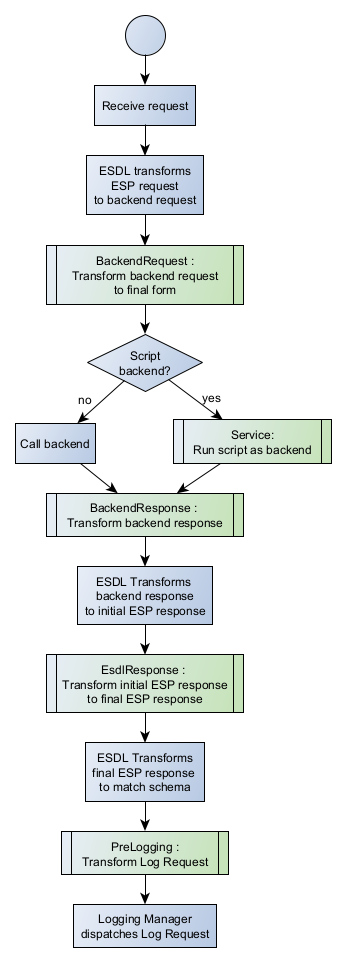

# DESDL Scripting

Using DESDL to implement services gives the benefit of robust interfaces isolated from the compiled code of the HPCC Platform itself. You can easily update an interface or service binding without building or deploying any new C++ code. It also provides integration with plugins to support robust logging and authentication.

However, anything beyond the most basic service will have some need for customization and logic beyond the standard steps of authenticate, call back-end service and log. To support this customization and logic we've implemented a scripting engine with hooks into various steps of the transaction.

This document is an overview and reference of the DESDL scripting language.

## Table of Contents

<!-- TOC -->

- [DESDL Scripting](#desdl-scripting)
    - [Table of Contents](#table-of-contents)
- [Language Overview](#language-overview)
    - [Basic Example](#basic-example)
    - [Transaction Flow and Entry Points](#transaction-flow-and-entry-points)
        - [Illustrated by Table](#illustrated-by-table)
        - [Illustrated by Flowchart](#illustrated-by-flowchart)
- [Reference](#reference)
    - [Common Attributes and Conventions](#common-attributes-and-conventions)
        - [Attributes](#attributes)
            - [name](#name)
            - [target](#target)
            - [value](#value)
            - [source](#source)
            - [select](#select)
        - [Conventions](#conventions)
            - [Quoting Strings](#quoting-strings)
            - [Variable Resolution](#variable-resolution)
        - [Implicit Variables](#implicit-variables)
            - [method](#method)
            - [request](#request)
            - [service](#service)
            - [query](#query)
        - [System Parameters](#system-parameters)
            - [clientversion](#clientversion)
            - [espUserName](#espusername)
            - [espUserPeer](#espuserpeer)
            - [espUserRealm](#espuserrealm)
            - [espUserStatus](#espuserstatus)
        - [Authentication Plugin Parameters](#authentication-plugin-parameters)
            - [Secure User Settings](#secure-user-settings)
            - [Feature Authorization](#feature-authorization)
        - [Namespaces](#namespaces)
    - [Entry Points](#entry-points)
        - [BackendRequest](#backendrequest)
        - [BackendResponse](#backendresponse)
        - [Service](#service)
        - [EsdlResponse](#esdlresponse)
        - [PreLogging](#prelogging)
    - [XPath](#xpath)
        - [Custom Functions](#custom-functions)
            - [ensureDataSection](#ensuredatasection)
            - [getDataSection](#getdatasection)
            - [getFeatureSecAccessFlags](#getfeaturesecaccessflags)
            - [getLogOption](#getlogoption)
            - [getLogProfile](#getlogprofile)
            - [getStoredStringValue](#getstoredstringvalue)
            - [logOptionExists](#logoptionexists)
            - [secureAccessFlags](#secureaccessflags)
            - [storedValueExists](#storedvalueexists)
            - [tokenize](#tokenize)
            - [validateFeaturesAccess](#validatefeaturesaccess)
        - [Standard and Extended Functions](#standard-and-extended-functions)
    - [Commands](#commands)
        - [add-value](#add-value)
        - [append-to-value](#append-to-value)
        - [assert](#assert)
        - [choose](#choose)
        - [copy-of](#copy-of)
        - [element](#element)
        - [ensure-target](#ensure-target)
        - [ensure-target](#ensure-target)
        - [fail](#fail)
        - [for-each](#for-each)
        - [http-post-xml](#http-post-xml)
        - [if](#if)
        - [if-source](#if-source)
        - [if-target](#if-target)
        - [mysql](#mysql)
        - [mysql](#mysql)
        - [namespace](#namespace)
        - [param](#param)
        - [remove-node](#remove-node)
        - [rename-node](#rename-node)
        - [set-log-option](#set-log-option)
        - [set-log-profile](#set-log-profile)
        - [set-value](#set-value)
        - [source](#source)
        - [store-value](#store-value)
        - [target](#target)
        - [variable](#variable)
    - [Scripting Context](#scripting-context)
    - [Configuration](#configuration)

<!-- /TOC -->

# Language Overview

Scripts are written in XML and share some similarites with XSLT, but are easier to understand and have some powerful new features. These are some comparisons and contrasts to XSLT:

1. Scripts use xpaths and support standard, extended and custom xpath functions.
2. Variables can contain scalar or nodeset values.
3. You never have to construct a result from scratch, you are _transforming_ an existing element into your desired result. This gives sensible default behavior with no scripting and keeps required scripts smaller.
4. Does not use the often difficult to trace template matching behavior of xslt; scripts are more easily understood procedural functions.

## Basic Example

A very common use case for scripts is transforming the incoming request to the ESP into a format required by the backend roxie service. When ESDL is used the interfaces will match, but customization can be required for legacy services, or when business logic demands that the request be modified in some way.

Say we have an incoming ESP request in this format:

```xml
<soap:Envelope xmlns:soap="http://schemas.xmlsoap.org/soap/envelope/" xmlns:SOAP-ENC="http://schemas.xmlsoap.org/soap/encoding/" xmlns="urn:hpccsystems:ws:wssample:testmethod">
    <soap:Body>
        <TestMethodRequest>
            <Options>
                <StartDate>
                    <Year>1976</Year>
                    <Month>07</Month>
                    <Day>12</Day>
                </StartDate>
            </Options>
            <SearchBy>
                <Name>
                    <First>Jon</First>
                    <Last>Jonson</Last>
                </Name>
            </SearchBy>
        </TestMethodRequest>
    </soap:Body>
</soap:Envelope>
```

When using ESDL, the default request to the backend service would look something like this (Sample 1):

```xml
<soap:Envelope xmlns:soap="http://schemas.xmlsoap.org/soap/envelope/">
    <soap:Body>
        <TestModule.TestMethodService>
            <Context>...etc...</Context>
            <TestMethodRequest>
                <Row>
                    <Options>
                        <StartDate>
                            <Year>1976</Year>
                            <Month>07</Month>
                            <Day>12</Day>
                        </StartDate>
                    </Options>
                    <SearchBy>
                        <Name>
                            <First>Jon</First>
                            <Last>Jonson</Last>
                        </Name>
                    </SearchBy>
                </Row>
            </TestMethodRequest>
        </TestModule.TestMethodService>
    </soap:Body>
</soap:Envelope>
```

However, let's say the backend service expects a few differences -
1. StartDate is in YYYYMMDD format
2. Options must include the `ExtendedSearchEable` Secure User Setting (from the Authorization results of the Security Manager plugin)

Then the backend request must look like this (Sample 2):

```xml
<soap:Envelope xmlns:soap="http://schemas.xmlsoap.org/soap/envelope/">
    <soap:Body>
        <TestModule.TestMethodService>
        <Context>...etc...</Context>
        <TestMethodRequest>
            <Row>
                <Options>
                    <StartDate>19760712</StartDate>
                    <ExtendedSearchEnable>1<ExtendedSearchEnable>
                </Options>
                <SearchBy>
                    <Name>
                        <First>Jon</First>
                        <Last>Jonson</Last>
                    </Name>
                </SearchBy>
            </Row>
        </TestMethodRequest>
        </TestModule.TestMethodService>
    </soap:Body>
</soap:Envelope>
```

A script to make this change could be coded like this:

```xml
<es:BackendRequest name="TransformForRoxie" target="soap:Body/{$query}/{$request}" xmlns:es="urn:hpcc:esdl:script">
    <es:param name="ExtendedSearchEnable" value="0"/>
    <es:source xpath="soap:Body/*/*/Row/Options/StartDate">
        <es:set-value target="Options/StartDate" select="Year"/>
        <es:append-to-value target="Options/StartDate" select="Month"/>
        <es:append-to-value target="Options/StartDate" select="Day"/>
    </es:source>
    <es:set-value target="Options/ExtendedSearchEnable" select={$ExtendedSearchEnable}/>
</es:BackendRequest>
```

Let's discuss what each line of this script does.

```xml
<es:BackendRequest name="TransformForRoxie" target="soap:Body/{$query}/{$request}" xmlns:es="urn:hpcc:esdl:script">
```

The tag name of the root of the script, `BackendRequest`, specifies that it should be executed after the ESDL transformer has generated the default backend request, but just before it is sent to the backend. The action of the script can be thought of like the assignment of a variable: `x = Fn(x)`. The Left Hand Side **x** is modified by the result of the expression on the Right Hand Side **Fn(x)**. The Left Hand Side, or LHS is called the _target_ and the Right Hand Side or RHS is called the _source_. The scripting engine starts out each entry point by copying the _source_ to the _target_. In this example the _source_ and _target_ start out looking like **Sample 1**. By the time script is completed the _target_ is **Sample 2**.

The `@name` attribute is used for tracing and error reporting. The `@target` attribute is an xpath specifying the default root node of the target for all subsequent operations. If it is not present the root is the `<soap:Envelope>`. The `{$query}` and `{$request}` variables are special system macros that are set to the name of the backend query and reqeust respectively.

The `@xmlns` attribute is the standard XML definition of a namespace prefix. For ESDL scripts the namespace URN `urn:hpcc:esdl:script` is recommended but not required. You can also define your own prefix (we use `es`), but the namespace prefixes and definitions should be consistent across all scripts in a service.

```xml
<es:param name="ExtendedSearchEnable" value="0"/>
```

This line defines a parameter named `ExtendedSearchEnable` with a default value of zero `0`. To make use of one of the values that the scripting engine makes available, a script must declare that parameter with the `<es:param>` command. Setting the  `@value` attribute is important to ensure you don't trigger an error by referencing an undefined parameter. This parameter is pulled from the Authorization results. It's name corresponds to the _path_ value of a _Secure User Setting_. These are configured using configmgr under an EspProcess's _ESP Service Bindings_ tab.

```xml
<es:source xpath="soap:Body/*/*/Row/Options/StartDate">
```

This modifies the default root node of the source of all child operations. The `@xpath` attribute speficies the node to make the default source root node.

```xml
<es:set-value target="Options/StartDate" select="Year"/>
```

This sets the value of the target node specified by `@target` to the value of the node specified by `@source`. Any previous value of `@target` is replaced by the new value of `@source`. Because this command is a child of the previous `<es:source>` command, the `@select` is relative to `soap:Body/*/*/Row/Options/StartDate`

```xml
<es:append-to-value target="Options/StartDate" select="Month"/>
<es:append-to-value target="Options/StartDate" select="Day"/>
```

These both append the value of the `@select` node to the value of the `@target` node.

## Transaction Flow and Entry Points

Which version reads better?

### Illustrated by Table

The lifecycle of an ESP transaction has the steps below in the _Transaction Step_ column performed in order. Optionally, scripts can be inserted at any of the entry points named in bold type below in the _Script Entry Point_ column. At each entry point the script has the opportunity to transform the source in preparation for passing it on to the next transaction step.

Order | Transaction Step                                 | Script Entry Point
------|--------------------------------------------------|-------------------
  1   | Reciept of request from client                   |
  2   | Authentication and Authorization                 |
  3   | ESDL Transforms ESP Request to backend request   |
  4   | | **BackendRequest** : Transform backend request to final form
  5   | Backend is called, sending backend request       | **Service** : A script is run instead of calling out to the backend
  6   | Backend response received                        |
  7   | | **BackendResponse** : Transform backend response
  8   | ESDL Transforms backend response to initial ESP response |
  9   | | **ESDL Response** : Transform initial ESP response to final ESP response
  10  | ESDL Transforms final ESP response to match schema |
  11  | ESP sends final response to client |
  12  | | **PreLogging** : Transform Log Request
  13  | Logging Manager dispatches Log Request

A script is inserted to an entry point by naming its root node after the name of the entry point. A script can replace a backend service call by configuring it as a **Service** entry point.

Additional details about the entry points and script configuration is found in the reference section.

### Illustrated by Flowchart

The lifecycle of an ESP transaction is shown below in the flowchart's blue boxes. Optionally, scripts can be inserted at any of the entry points named in green boxes. At each entry point the script has the opportunity to transform the source in preparation for passing it on to the next transaction step.



A script is inserted to an entry point by naming its root node after the name of the entry point. A script can replace a backend service call by configuring it as a **Service** entry point.

Additional details about the entry points and script configuration is found in the reference section.

# Reference

## Common Attributes and Conventions

### Attributes

#### name

Assumed to be a scalar value, not an xpath, so quoting is not required.

#### target

As an attribute of the endpoint element this has some additional characteristics:

 * Special macros for the configured back end query `{$query}` and the ESP SOAP request `{$request}` are available to use.
 * In the 8.0 release and earlier, the xpath must exist at runtime or an exception will be thrown. A future release will ensure the path exists without throwing an exception.

#### value

#### source

As an attribute of the endpoint element this has some additional characteristics:

 * Special macros for the configured back end query `{$query}` and the ESP SOAP request `{$request}` are available to use.

#### select

### Conventions

#### Namespaces

Namespaces referenced in any of your xpaths must be defined in your scripts to match the XML being processed. One exception is that the BackendRequest entry point will automatically detect and define the standard soap namespace (xmlns:soap="http://schemas.xmlsoap.org/soap/envelope/") if it is used in your source XML.

When your source XML uses a namespace prefix as part of the tag name, you must also use it in your xpath referencing that node.

If a node defines a namespace without a prefix, you must define that namespace with a prefix in the root of your script. Then you must use the prefix in any xpaths referencing that node. Any children of that node in the source XML must not be referred to with the prefix you defined in your script:

*source XML:*
```xml
<script_context_section>
    <request url="http://certstagingvip.hpcc.risk.regn.net:9876">
      <content>
        <soap:Envelope xmlns:soap="http://schemas.xmlsoap.org/soap/envelope/">
          <soap:Body>
            <inquiry_services.log_service xmlns="urn:hpccsystems:ecl:inquiry_services.log_service">
              <city>minneapolis</city>
              <state>mn</state>
              <zip>55419</zip>
            </inquiry_services.log_service>
          </soap:Body>
        </soap:Envelope>
      </content>
    </request>
</script_context_section>
```
If I want to refer to the the `city` node above, my script would look like this:

```xml
<BackendRequest name="TestScript" xmlns:es="urn:hpcc:esdl:script" source="script_context_section" xmlns:soap="http://schemas.xmlsoap.org/soap/envelope/" xmlns:insvc="urn:hpccsystems:ecl:inquiry_services.log_service">
    <es:set-value target="city-value" select="request/soap:Envelope/soap:Body/insvc:inquiry_services.log_service/city"/>
</BackendRequest>
```

*Provide some examples*

#### Quoting Strings

String tokens must be quoted in xpath expressions. Our xpath expressions occur in XML attributes, which also must be quoted. However, the quotes used to delimit the attribute cannot be contained inside the xpath expression. Usually this is handled by using double-quotes for attributes and  apostrophes (single quotes), for quoting inside the attribute. For example:

```xml
<es:set-value target="name" value="'foobar'"/>
```

In some cases you may see XML or xpath parsing errors when using the single quotes depending on your workflow (_establish precisely when this occurs_). This may be caused by unescaped apostrophes, which you can remedy like this:

```xml
<es:set-value target="name" value="&apos;foobar&apos;"/>
```

So far we've concluded that escaping is not required in these attributes:

* `getDataSection()` function inside entry point `@source`
* `set-value` `@value`

#### Variable Resolution
Explain how variables don't resolve in select xpaths as might be expected, and show the local-name() workaround.

### Implicit Variables

#### method

#### request

#### service

#### query

### System Parameters

#### clientversion

#### espUserName

#### espUserPeer

#### espUserRealm

#### espUserStatus

### Authentication Plugin Parameters
Mention the static and dynamic configuration required to set these up.

#### Secure User Settings

#### Feature Authorization

### Namespaces

## Entry Points

Generally, each entry point has default source and target nodes, which are the root nodes for read and write commands respectively. These defaults can be overridden with `@source` and `@target` attributes in the entry point, which we'll discuss here, and also using [source](#source) and [target](#target) [commands](#commands).

At the end of each script

### BackendRequest

**default source** : esdl_request
**default target** : final_request

### BackendResponse

### Service

### EsdlResponse

**default source** : initial_esdl_response
**default target** : modified_esdl_response

### PreLogging

**default source** : logdata
**default target** : logdata

## XPath

### Custom Functions

Several custom xpath functions are defined to aid in scripting. They can be used in any attribute that accepts an xpath.

#### ensureDataSection

```javascript
ensureDataSection([section_name])
```

section_name : Optional xpath

Ensures the script context section named *section_name* exists and returns it. If no section name is provided, it returns the section for temporary values that stays valid through the lifetime of the transaction.

Will return an empty node set if the xpath evaluation of *section_name* fails.

##### Example

```xml
<es:BackendRequest xmlns:es="urn:hpcc:esdl:script">
    <es:set-value target="ensureDataSection(&apos;mySection&apos;)/firstValue" value="&apos;23&apos;"/>
</es:BackendRequest>
```
Results in this change to the ScriptContext:

*Question: Do we want to expose the actual root and section names, or abstract them to promote better coding practice?*

```xml
<ScriptContext>
    <BackendRequest>...</BackendRequest>
    <BackendResponse>...</BackendResponse>
    <mySection>
        <firstValue>23</firstValue>
    </mySection>
</ScriptContext>
```

#### getDataSection

```javascript
getDataSection([section_name])
```

section_name : Optional xpath

Returns the xml node named *section_name* of the script context. If no section name is provided, it returns the section for temporary values that stays valid through the lifetime of the transaction.

Will return an empty node set if the xpath evaluation of *section_name* fails.

##### Example

Assume we have the ScriptContext from the `ensureDataSection()` example above.

```xml

```

#### getFeatureSecAccessFlags


#### getLogOption

#### getLogProfile

#### getStoredStringValue

#### logOptionExists

#### secureAccessFlags

#### storedValueExists

#### tokenize

#### validateFeaturesAccess

### Standard and Extended Functions
Mention briefly what they are and point to existing online documentation for details.

## Commands

### add-value

### append-to-value

### assert

### choose

### copy-of

Designed to copy a whole node. More complex xpaths in the select attribute that yield a transformation of the source node will result in undefined behavior.

### element

### ensure-target

### fail

### for-each

### http-post-xml

### if

### if-source

### if-target

### mysql

### namespace

### param

Define a parameter for use by the script. Parameters are immutable. They are in scope for any sibling or descendent elements of the variable definition. The param command can only be a child of the following elements:

* Any endpoint
* `element`
* `ensure-target`
* `for-each`
* `if`
* `if-target`
* `otherwise`
* `parameter`
* `target`
* `variable`
* `when`
* `xml-http-post`

It is disallowed as a child of these elements:

* `choose`
* `if-source`
* `source`

If a parameter is defined inside one of the disallowed elements, the script will be valid but incorrect. In that situation, if the parameter is referenced inside an xpath an error "Could not evaluate XPATH '*xpath containing parameter reference*'". A future update will handle this error condition more robustly.


### remove-node

### rename-node

### set-log-option

```xml
<es:set-log-option name="option-name" value="option-value"/>
```
set-log-option is a method to transfer state from the transaction processing to the logging. It creates a data element named *option-name* containing *option-value* that is made available in the UpdateLogRequest XML provided to loggingagents. For the example above the UpdateLogRequest would be:

```xml
<UpdateLogRequest>
    <logging option-name="option-value"/>
</UpdateLogRequest>
```
It can be referenced from a loggingagent configuration with the xpath `logging[@option-name]`

### set-log-profile

### set-value

### source

### store-value

```xml
<es:store-value name="value_name" select="value_to_store"/>
<es:store-value xpath_name="value_name_xpath" select="value_to_store"/>
```

### target

### variable

Define a variable for use by the script. Variables are immutable. Variables are in scope for any sibling or descendent elements of the variable definition. The variable command can only be a child of the following elements:

* Any endpoint
* `element`
* `ensure-target`
* `for-each`
* `if`
* `if-target`
* `otherwise`
* `parameter`
* `target`
* `variable`
* `when`
* `xml-http-post`

It is disallowed as a child of these elements:

* `choose`
* `if-source`
* `source`

If a variable is defined inside one of the disallowed elements, the script will be valid but incorrect. In that situation, if the variable is referenced inside an xpath an error "Could not evaluate XPATH '*xpath containing variable reference*'". A future update will handle this error condition more robustly.


## Scripting Context
*Describe layout and contents of different sections. Does this need to be higher up to help readers understand? Let's see how it flows.*

When the esp logLevel >= LogMax, then after executing each entry point's scripts the ESP prints out the contents of the context with the label *Entire script context after transforms:*

```xml
<esdl_script_context>
    <esdl></esdl>
    <original_request></original_request>
    <target></target>
    <config></config>
    <esdl_request></esdl_request>
    <final_request></final_request>
    <initial_response></initial_response>
    <pre_esdl_response></pre_esdl_response>
    <logdata>
        Never actually added to the context, but passed direclty
        on to the LoggingManager to queue up for the LogAgents.
    </logdata>
    <logging></logging>
    <store></store>
</esdl_script_context>
```

## Configuration
*Explain how the scripts are configured in the dynamic binding. Mention, perhaps, the upcoming manifest tool to generate bindings, including scripts, from a collection of source files.*

You can adjust how much debugging information is sent to the trace file by adding a `traceLevel` attribute to any `<Method>` configuration. Valid values are 1-10 with 10 being the most verbose and the default being 1. Additionally, adding the attribute `trace="<name>"` to any script's root entry-point named tag will use that name for error-level trace output related to that script.